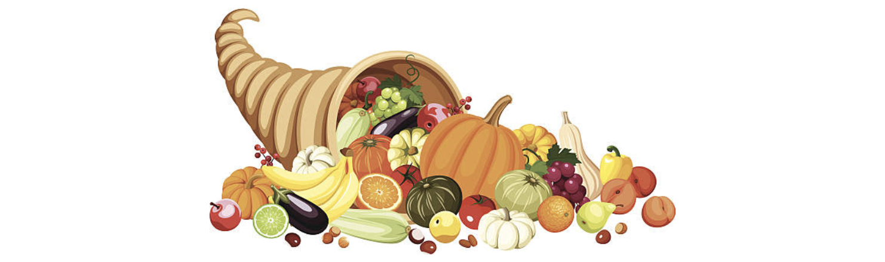

# Tutorials

We recommend that you complete these tutorials in order starting with Wisdom for Sale.

  

    <a href="/en/books/essentials/tutorials/wisdom-for-sale/">
      

        
        

          <h5 class="card-title">Wisdom for Sale</h5>
          
Lorem ipsum dolor sit amet, consectetur adipiscing elit, sed do eiusmod tempor incididunt ut labore et dolore magna aliqua. Ut enim ad minim veniam, quis nostrud exercitation ullamco laboris nisi ut aliquip ex ea commodo consequat.

        

      

    </a>
  

  

    <a href="/en/books/essentials/tutorials/market-day/">
      

        
        

          <h5 class="card-title">Market Day</h5>
          
Lorem ipsum dolor sit amet, consectetur adipiscing elit, sed do eiusmod tempor incididunt ut labore et dolore magna aliqua. Ut enim ad minim veniam, quis nostrud exercitation ullamco laboris nisi ut aliquip ex ea commodo consequat. 

        

      

    </a>
  

  

    <a href="/en/books/essentials/tutorials/rock-paper-scissors/">
      

        
        

          <h5 class="card-title">Rock Paper Scissors</h5>
          
Lorem ipsum dolor sit amet, consectetur adipiscing elit, sed do eiusmod tempor incididunt ut labore et dolore magna aliqua. Ut enim ad minim veniam, quis nostrud exercitation ullamco laboris nisi ut aliquip ex ea commodo consequat. 

        

      

    </a>
  

