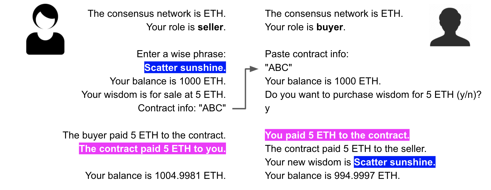
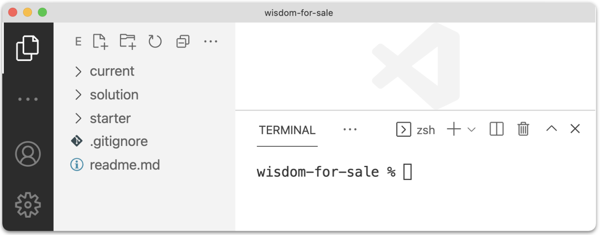
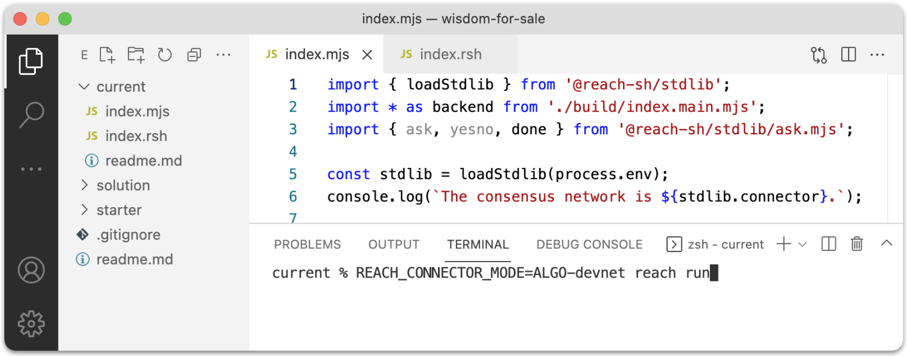
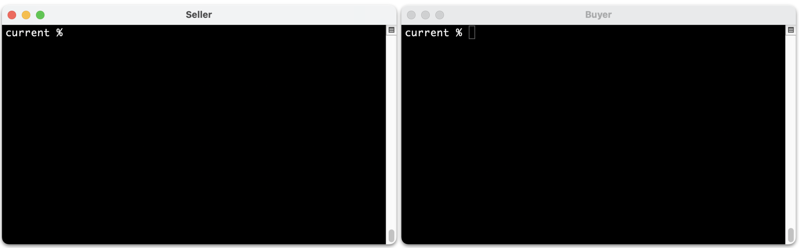

# Wisdom for Sale

This tutorial introduces you to Reach DApp development and prepares you for more advanced Reach tutorials and projects. It is primarily task-based, but it includes several *Information* buttons throughout. Be sure to complete [Quick Start](/en/books/essentials/quick-start/) and [Development Environment](/en/books/essentials/developer-environment/) before proceeding.

# Overview

During this tutorial, you will build command-line and webapp versions of [Wisdom for Sale](https://github.com/hagenhaus/wisdom-for-sale), an application that enables two participants, a seller and a buyer, to trade wisdom for currency via a smart contract running on a private Algorand, Ethereum, or Conflux consensus network (e.g. devnet) residing in a Docker container on your computer. Your DApp will create and fund two accounts, one for each participant. Then, it will enable the seller and buyer to make a deal.

<div class="d-grid">
<button class="btn btn-secondary btn-sm text-start" type="button" data-bs-toggle="collapse" data-bs-target="#deal" aria-expanded="false">
  <i class="fas fa-info-circle me-2"></i><span>Seller-Buyer Diagram</span>
</button>
</div>

<span class="collapse" id="deal">

The following diagram represents the wisdom-for-sale deal.

<div></div>

This particular transaction took place on an Ethereum devnet. The Ethereum cryptocurrency standard token unit is the *Ether* or *ETH*. The tutorial also allows you to perform this transaction on an Algorand or Conflux devnet. The Algorand standard unit is the *ALGO*, and the Conflux standard unit is the *CFX*. As indicated by the final balances in the diagram, the seller received 0.0019 ETH less than the agreed upon price, and the buyer paid 0.0003 ETH more. These expenses represent *gas*, the cost of doing business on a consensus network. The seller paid a little more gas than the buyer because the seller deployed the contract.

<hr style="background-color:#6c757d;opacity:1;height:5px;"/>
</span>

Creating a Reach DApp does *not* entail implementing a smart contract. Rather, it involves using the Reach programming language to describe, step by step, participant interactions from which the Reach compiler derives a smart contract.

<div class="d-grid">
<button class="btn btn-secondary btn-sm text-start" type="button" data-bs-toggle="collapse" data-bs-target="#stf" aria-expanded="false">
  <i class="fas fa-info-circle me-2"></i><span>Develop & Deploy Video</span>
</button>
</div>

<span class="collapse" id="stf">

This video provides a mental framework for understanding Reach development and deployment.

<p class="ratio ratio-16x9 my-4" style="max-width:500px;">
  <iframe 
    src="https://www.youtube.com/embed/4MJqPNelqCE" 
    frameborder="0"  
    allowfullscreen>
  </iframe>
</p>

Mentioned in the video are (1) the Reach [JavaScript Standard Library](/en/books/essentials/support-for-js-frontends/) which supports Reach applications by providing properties and methods dealing with accounts, arithmetic, big numbers, comparisons, consensus network providers, contracts, debugging, encryption, randomization, and time, (2) interact objects which are JavaScript objects that enable communication between Reach frontends and backends, explained in detail below, and (3) the Reach Verification Engine which helps to ensure that the immutable smart contract you deploy will run without errors like the error of forgetting to transfer all the otherwise unretrievable tokens out of a smart contract account before the contract exits.

<hr style="background-color:#6c757d;opacity:1;height:5px;"/>
</span>

# Clone the repository

Be sure to complete [Quick Start](/en/books/essentials/quick-start/) and [Development Environment](/en/books/essentials/developer-environment/) before proceeding.

1. Clone the [wisdom-for-sale](https://github.com/hagenhaus/wisdom-for-sale) repository:

    ``` nonum
    $ cd ~/reach
    $ git clone https://github.com/hagenhaus/wisdom-for-sale.git
    ```

1. Open the repository in vscode.

    <p></p>

1. Copy *index.mjs* and *index.rsh* from the *starter* folder to the *current* folder, and open both files.

<div class="d-grid">
<button class="btn btn-secondary btn-sm text-start" type="button" data-bs-toggle="collapse" data-bs-target="#rsf" aria-expanded="false">
  <i class="fas fa-info-circle me-2"></i><span>Review Starter Files</span>
</button>
</div>

<span class="collapse" id="rsf">

**index.mjs**

``` js
load: https://raw.githubusercontent.com/hagenhaus/wisdom-for-sale/master/starter/index.mjs
```

Below is a line-by-line description:

* Line 1: Import the Reach JS Standard Library loader.
* Line 2: Import the JS backend compiled from index.rsh.
* Line 3: Import a Reach Node.js package to help with command-line i/o.
* Line 5: Load the Reach JS Stdlib for the consensus network specified by the `REACH_CONNECTOR_MODE`.
* Line 6: Display the consensus network type.
* Line 8: Hard-code the role. You will change this later.
* Line 9: Display the role.
* Line 11: Enable enclosed code to await the fulfillment of promises.
* Line 14: Code for when you run this app as the seller.
* Line 15: Create an account for the seller. *parseCurrency* transforms units from standard to atomic.
* Line 16: Get a reference to the contract.
* Line 17: Call `Seller(ctc, interact)` in *index.main.mjs* which deploys the contract.
* Line 24: Tell *ask.mjs* that you are finished.

**index.rsh**

``` js
load: https://raw.githubusercontent.com/hagenhaus/wisdom-for-sale/master/starter/index.rsh
```

Below is a line-by-line description:

* Line 1: Instruction to the compiler.
* Line 3: Reach standard application initialization.
* Line 4: Define a constant to represent the seller. The `{}` indicates an empty interact object.
* Line 5: Define a constant to represent the buyer. Same.
* Line 6: Finalize participant and other options.
* Line 8: Terminate computation.

<hr style="background-color:#6c757d;opacity:1;height:5px;"/>
</span>

# Run the app

Run your starter app in the vscode terminal three times, once for each supported consensus network, using the commands below in succession:

``` nonum
$ REACH_CONNECTOR_MODE=ALGO-devnet reach run
$ REACH_CONNECTOR_MODE=ETH-devnet reach run
$ REACH_CONNECTOR_MODE=CFX-devnet reach run
```

<p></p>

In your current environment, most executables -- the Reach Compiler, the consensus network devnets, your application, and the smart contract -- run in Docker containers instantiated from Reach Docker images.

<div class="d-grid">
<button class="btn btn-secondary btn-sm text-start" type="button" data-bs-toggle="collapse" data-bs-target="#ebp" aria-expanded="false">
  <i class="fas fa-info-circle me-2"></i><span>Explore Build Output</span>
</button>
</div>

<span class="collapse" id="ebp">

Here is sample output:

```
current % REACH_CONNECTOR_MODE=ALGO-devnet reach run
Verifying knowledge assertions
Verifying for generic connector
  Verifying when ALL participants are honest
  Verifying when NO participants are honest
  Verifying when ONLY "Buyer" is honest
  Verifying when ONLY "Seller" is honest
Checked 4 theorems; No failures!
[+] Building 0.2s (7/7) FINISHED
 => [internal] load build definition from Dockerfile                                         0.0s
 => => transferring dockerfile: 234B                                                         0.0s
 => [internal] load .dockerignore                                                            0.0s
 => => transferring context: 75B                                                             0.0s
 => [internal] load metadata for docker.io/reachsh/runner:0.1.5                              0.0s
 => [internal] load build context                                                            0.0s
 => => transferring context: 4.60kB                                                          0.0s
 => CACHED [1/2] FROM docker.io/reachsh/runner:0.1.5                                         0.0s
 => [2/2] COPY . /app                                                                        0.0s
 => exporting to image                                                                       0.0s
 => => exporting layers                                                                      0.0s
 => => writing image sha256:13e69eb72504bbc85074476e5d1183b6ad2734a5eabc9e56c2138023d64a507a 0.0s
 => => naming to docker.io/reachsh/reach-app-current:latest                                  0.0s

Use 'docker scan' to run Snyk tests against images to find vulnerabilities and learn how to fix them
Creating reach2021-10-13t14-26-55z-vcv1_reach-app-current_run ... done

> @reach-sh/current@ index /app
> node --experimental-modules --unhandled-rejections=strict index.mjs

The consensus network is ALGO.
Your role is seller.
```

Below is a line-by-line description:

* Line 1: The Reach Compiler inputs *reach.rsh*.

    <p></p>

    And, it outputs *index.main.mjs* consisting of the compiled backend (blue) and the smart contract (dark orange):

    <p></p>

* Line 2: The Reach Verification Engine validates the smart contract:

    <p></p>

* Lines 10-22: The process builds a Docker image for your application.

    <p></p>

    Note the mention of *Dockerfile* and *.dockerignore*. The `reach run` command creates the following set of files, deleting all but *index.main.mjs* on completion:

    ``` nonum
    build/index.main.mjs
    .dockerignore
    .gitignore
    Dockerfile
    package.json
    ```

    For some of your Reach projects, you may find it useful to retain and edit these files, especially *package.json*. To create and retain these files, run `reach scaffold` before running `reach run`.

* Line 24: The process checks the new image for vulnerabilities.

    <p></p>

* Line 27: The process runs your app in a container built from the image.

    <p></p>

* Line 30-31: Your application outputs these messages.

<hr style="background-color:#6c757d;opacity:1;height:5px;"/>
</span>

# Pass role as argument

Modify the starter app to accept a command-line argument specifying whether to run as the seller or buyer. Although this change does not involve Reach directly, it does emphasize that your application represents two different participants negotiating via the same contract.

1. In *index.mjs*, replace `const role = 'seller';` with the following:

    ``` js
    if (process.argv.length < 3 || ['seller', 'buyer'].includes(process.argv[2]) == false) {
      console.log('Usage: reach run index [seller|buyer]');
      process.exit(0);
    }
    const role = process.argv[2];
    ```

1. Open two terminals (i.e. shells), and change directory in both to `~/reach/wisdom-for-sale/current`:

    <p></p>

    The left terminal is the *Seller Terminal*, and the right is the *Buyer Terminal*.

1. In the Seller Terminal, run one of the following:

    ``` nonum
    $ REACH_CONNECTOR_MODE=ALGO-devnet reach run index seller
    $ REACH_CONNECTOR_MODE=ETH-devnet reach run index seller
    $ REACH_CONNECTOR_MODE=CFX-devnet reach run index seller
    ```

    When you pass arguments to `reach run`, the first one must be the name of the `index.rsh` file without the extension (i.e. `index`). Application output should be the following:

    ``` nonum
    The consensus network is ALGO|ETH|CFX.
    Your role is seller.
    ```

1. In the Buyer Terminal, run the corresponding command (one of the following):

    ``` nonum
    $ REACH_CONNECTOR_MODE=ALGO-devnet reach run index buyer
    $ REACH_CONNECTOR_MODE=ETH-devnet reach run index buyer
    $ REACH_CONNECTOR_MODE=CFX-devnet reach run index buyer
    ```

    Output:

    ``` nonum
    The consensus network is ALGO|ETH|CFX.
    Your role is buyer.
    ```

1. Repeat for the other consensus networks.

You can, instead, use a Node.js package like [Minimist](https://www.npmjs.com/package/minimist), [Commander](https://www.npmjs.com/package/commander), [Meow](https://www.npmjs.com/package/meow), [Yargs](https://www.npmjs.com/package/yargs), or [Vorpal](https://www.npmjs.com/package/vorpal).

<div class="d-grid">
<button class="btn btn-secondary btn-sm text-start" type="button" data-bs-toggle="collapse" data-bs-target="#npi" aria-expanded="false">
  <i class="fas fa-info-circle me-2"></i><span>Node Package Integration</span>
</button>
</div>

<span class="collapse" id="npi">

Not done yet.

<hr style="background-color:#6c757d;opacity:1;height:5px;"/>
</span>

You cannot pass information to your Reach DApp via environment variables. The [reach](https://github.com/reach-sh/reach-lang/blob/master/reach) script exports only a limited set of environment variables within the Docker container where it runs your app, so it does not support exporting `role` (e.g. `ROLE=seller reach run`) or any other custom value as an environment variable.

# Use the Reach Stdlib

The Reach [JavaScript Standard Library](/en/books/essentials/support-for-js-frontends/) supports Reach applications by providing properties and methods dealing with accounts, arithmetic, big numbers, comparisons, consensus network providers, contracts, debugging, encryption, randomization, and time.

1. Add the following just below `const stdlib = loadStdlib(process.env)`:

    ``` js
    const suStr = stdlib.standardUnit;
    const toAU = (su) => stdlib.parseCurrency(su);
    const toSU = (au) => stdlib.formatCurrency(au, 4);
    const iBalance = toAU(1000);
    const showBalance = async (acc) => console.log(`Your balance is ${toSU(await stdlib.balanceOf(acc))} ${suStr}.`);
    ```

1. Find Line 1 below and change it to Line 2:

    ``` js
    const acc = await stdlib.newTestAccount(stdlib.parseCurrency(1000));
    const acc = await stdlib.newTestAccount(iBalance);
    ```

1. Add `showBalance` in two places like this:

    ``` js
    if (role === 'seller') {
      const acc = await stdlib.newTestAccount(iBalance);
      await showBalance(acc);
      const ctc = acc.deploy(backend);
      await backend.Seller(ctc, {});
      await showBalance(acc);
    }
    ```

1. Run the app in the Seller Terminal. 

    ``` nonum
    $ REACH_CONNECTOR_MODE=ALGO-devnet reach run index seller
    ```

    Below is the output. Eventually, the two `Your balance` lines will display the seller's account balances before and after the transaction.

    ``` nonum
    The consensus network is ALGO.
    Your role is seller.
    Your balance is 1000 ALGO.
    Your balance is 1000 ALGO.
    ```

Consensus network tokens are measured in (divisible) standard units and (indivisible) atomic units, and Reach apps often convert between the two.

<div class="d-grid">
<button class="btn btn-secondary btn-sm text-start" type="button" data-bs-toggle="collapse" data-bs-target="#ausu" aria-expanded="false">
  <i class="fas fa-info-circle me-2"></i><span>About toAU and toSU</span>
</button>
</div>

<span class="collapse" id="ausu">

Not done yet.

<hr style="background-color:#6c757d;opacity:1;height:5px;"/>
</span>

# Add seller interact objects

1. Add an interact object (Lines 4-12) to *index.mjs* for the seller:

    ``` js
    // SELLER
    if (role === 'seller') {

      // SELLER INTERACT
      const sellerInteract = {
        price: toAU(5),
        wisdom: 'Scatter sunshine.',
        reportReady: async (price) => {
          console.log(`Your wisdom is for sale at ${toSU(price)} ${suStr}.`);
          console.log(`Contract info: ${JSON.stringify(await ctc.getInfo())}`);
        }
      };

      ...
    }
    ```

1. Find Line 1 below and change it to Line 2:

    ``` js
    await backend.Seller(ctc, {});
    await backend.Seller(ctc, sellerInteract);
    ```

1. Add a corresponding interact object (Lines 3-8) to *index.rsh* for the seller:

    ``` js
    'reach 0.1';

    // SELLER INTERACT
    const sellerInteract = {
      price: UInt,
      wisdom: Bytes(128),
      reportReady: Fun([UInt], Null)
    };

    ...
    ```

1. Find Line 1 below and change it to Line 2:

    ``` js
    const S = Participant('Seller', {});
    const S = Participant('Seller', sellerInteract);
    ```

1. Add actions (Lines 3-6) for seller in *index.rsh*:

    ``` js
      deploy();

      S.only(() => { const price = declassify(interact.price); });
      S.publish(price);
      S.interact.reportReady(price);
      commit();

      exit();
    ```

1. Run in the Seller Terminal:

    ``` nonum
    $ REACH_CONNECTOR_MODE=ETH-devnet reach run index seller
    ```

    Output should resemble the following:

    ``` nonum
    The consensus network is ETH.
    Your role is seller.
    Your balance is 1000 ETH.
    Your wisdom is for sale at 5 ETH.
    Contract info for buyer: 0xbBD687F2cCa8AC0cB4c51ff0Da9632eF32aC1F7D.
    Your balance is 999.9998 ETH.
    ```

Interact objects facilitate communication between the frontend (i.e. `index.mjs`) and backend (i.e. `index.main.mjs`) of Reach applications. Recall that `index.rsh` is the pre-compiled version of `index.main.mjs`.

<div class="d-grid">
<button class="btn btn-secondary btn-sm text-start" type="button" data-bs-toggle="collapse" data-bs-target="#aio" aria-expanded="false">
  <i class="fas fa-info-circle me-2"></i><span>About Interact Objects</span>
</button>
</div>

<span class="collapse" id="aio">

Not done yet.

<hr style="background-color:#6c757d;opacity:1;height:5px;"/>
</span>

Each Reach backend action (e.g. `declassify(interact.price)`) takes place within the context of a *local step*, *step*, or *consensus step*. Actions involving one participant take place within a *local step*. Those involving all participants take place within a *step*. Those involving the contract itself take place within a *consensus step*. 

<div class="d-grid">
<button class="btn btn-secondary btn-sm text-start" type="button" data-bs-toggle="collapse" data-bs-target="#as" aria-expanded="false">
  <i class="fas fa-info-circle me-2"></i><span>About Steps</span>
</button>
</div>

<span class="collapse" id="as">

Not done yet.

<hr style="background-color:#6c757d;opacity:1;height:5px;"/>
</span>

# Add buyer interact objects

1. Add an interact object and supporting code to *index.mjs* for the buyer:

    ``` js
    // BUYER
    else {

      // BUYER INTERACT
      const buyerInteract = {
        confirmPurchase: async (price) => await ask(`Do you want to purchase wisdom for ${toSU(price)} ${suStr} (y/n)?`, yesno)
      };

      const acc = await stdlib.newTestAccount(iBalance);
      const info = await ask('Paste contract info:', (s) => JSON.parse(s));
      const ctc = acc.attach(backend, info);
      await showBalance(acc);
      await backend.Buyer(ctc, buyerInteract);
      await showBalance(acc);
    }
    ```

1. Add a corresponding interact object to *index.rsh* (under `sellerInteract`) for the buyer:

    ``` js
    // BUYER INTERACT
    const buyerInteract = {
      confirmPurchase: Fun([UInt], Bool)
    };
    ```

1. Find Line 1 below and change it to Line 2:

    ``` js
    const S = Participant('Buyer', {});
    const S = Participant('Buyer', buyerInteract);
    ```

1. Add actions for buyer in *index.rsh*:

    ``` js
    B.only(() => {
      const willBuy = declassify(interact.confirmPurchase(price));
    });
    B.publish(willBuy);

    if (!willBuy) {
      commit();
    } else {
      commit();
    }
    ```

1. Run the app in the Seller and Buyer Terminals. Provide the contract info to the buyer when prompted. Answer `y` or `n` when asked whether to buy wisdom.

The seller creates the contract, retrieves a contract reference in the form of contract info, and makes the info available to the buyer who uses it to find and run the smart contract.

<div class="d-grid">
<button class="btn btn-secondary btn-sm text-start" type="button" data-bs-toggle="collapse" data-bs-target="#ci" aria-expanded="false">
  <i class="fas fa-info-circle me-2"></i><span>About Contract Info</span>
</button>
</div>

<span class="collapse" id="ci">

Not done yet.

<hr style="background-color:#6c757d;opacity:1;height:5px;"/>
</span>

# Add common interact objects

1. Add a common interact object to *index.mjs*, shared by the seller and buyer:

    ``` js
    // COMMON INTERACT
    const commonInteract = {
      reportCancellation: () => { console.log('The buyer cancelled the order.'); }
    };
    ```

1. Add the `...commonInteract` object to `sellerInteract` and `buyerInteract` in *index.mjs*:

    ``` js
    const sellerInteract = {
      ...commonInteract,
    };

    const buyerInteract = {
      ...commonInteract,
    };
    ```

1. Add a common interact object to *index.rsh*:

    ``` js
    // COMMON INTERACT
    const commonInteract = {
      reportCancellation: Fun([], Null)
    };
    ```

1. Add the `...commonInteract` object to `sellerInteract` and `buyerInteract` in *index.rsh*:

    ``` js
    const sellerInteract = {
      ...commonInteract
    };

    const buyerInteract = {
      ...commonInteract
    };
    ```

1. Report cancellation in *index.rsh*:

    ``` js
    if (!willBuy) {
      commit();
      each([S, B], () => interact.reportCancellation());
      exit();
    } else {
      commit();
    }
    ```

1. Run the app in the Seller and Buyer Terminals. Answer `n` when asked whether to buy wisdom. Both terminals should display the following output:

    ``` nonum
    The buyer cancelled the order.
    ```

1. Modify `commonInteract` in *index.mjs* to accept and use a `role` argument:

    ``` js
    const commonInteract = (role) => ({
      reportCancellation: () => { console.log(`${role == 'buyer' ? 'You' : 'The buyer'} cancelled the order.`); }
    });
    ```

1. Modify `sellerInteract` and `buyerInteract` in *index.mjs* to pass `role` to *commonInteract*:

    ```
    const sellerInteract = {
      ...commonInteract(role),
    }

    const buyerInteract = {
      ...commonInteract(role),
    }
    ```

1. Retest. The app (running as the buyer) should output the following:

    ```
    You cancelled the order.
    ```

# Complete the transaction

1. Modify `commonInteract` in *index.mjs*:

    ``` js
    const commonInteract = (role) => ({
      reportPayment: (payment) => console.log(`${role == 'buyer' ? 'You' : 'The buyer'} paid ${toSU(payment)} ${suStr} to the contract.`),
      reportTransfer: (payment) => console.log(`The contract paid ${toSU(payment)} ${suStr} to ${role == 'seller' ? 'you' : 'the seller'}.`),
      reportCancellation: () => { console.log(`${role == 'buyer' ? 'You' : 'The buyer'} cancelled the order.`); }
    });
    ```

1. Modify `commonInteract` in *index.rsh*:

    ``` js
    const commonInteract = {
      reportPayment: Fun([UInt], Null),
      reportTransfer: Fun([UInt], Null),
      reportCancellation: Fun([], Null)
    };
    ```

1. Add pay and transfer steps in *index.rsh*:

    ``` js
    B.pay(price);
    each([S, B], () => interact.reportPayment(price));
    commit();

    S.only(() => { const wisdom = declassify(interact.wisdom); });
    S.publish(wisdom);
    transfer(price).to(S);
    commit();

    each([S, B], () => interact.reportTransfer(price));
    B.interact.reportWisdom(wisdom);
    ```

1. Test.
