# Home

  

    

      

        
Reach is the ideal programming language for blockchain applications.</b>

      

    

    

      
<a class="btn btn-success step" href="/en/books/essentials/" role="button" style="width:100%;">Overview</a>

      
<a class="btn btn-success step" href="/en/books/essentials/tutorials/" role="button" style="width:100%;">Tutorials</a>

    

    

      

        

          

            
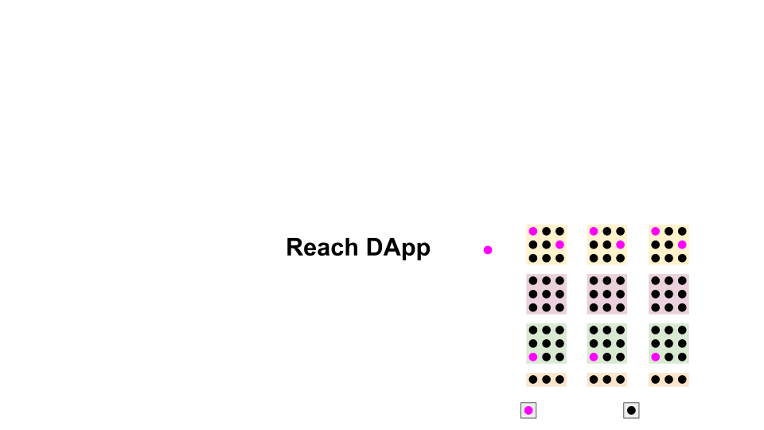

            
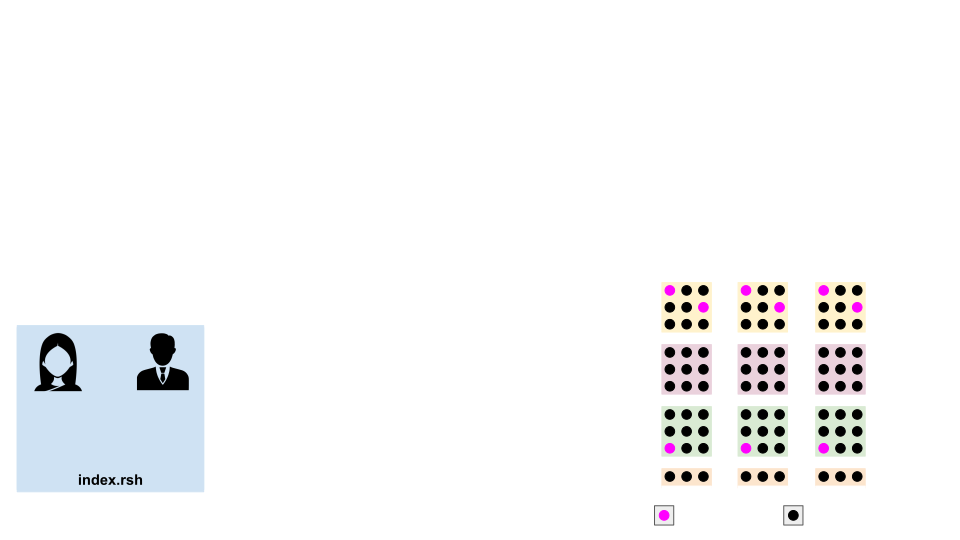

            
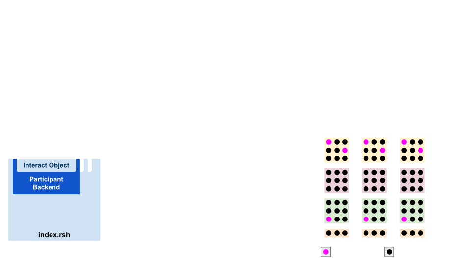

            
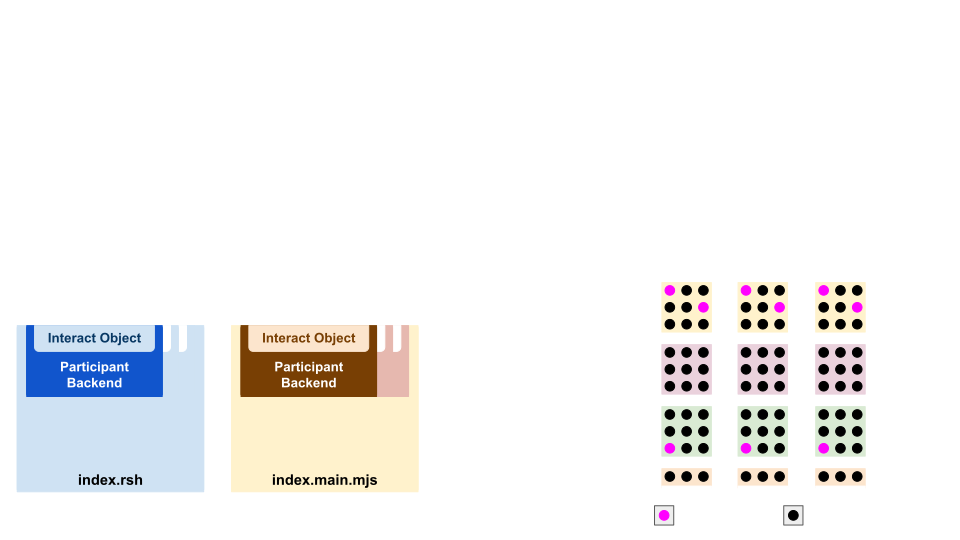

            
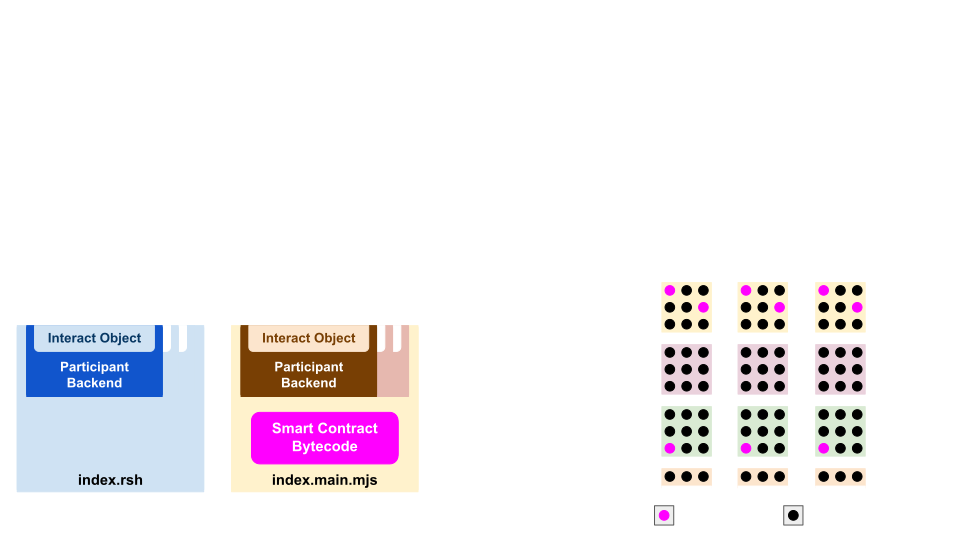

            
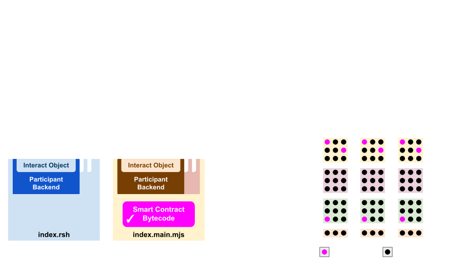

            
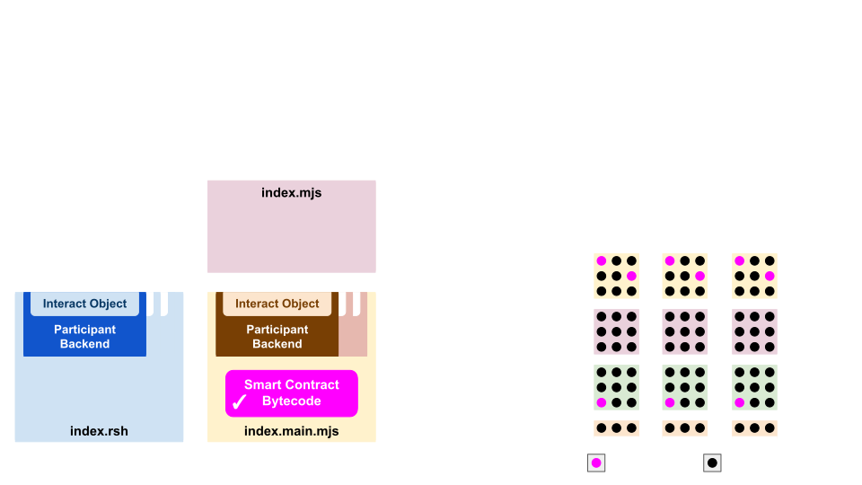

            
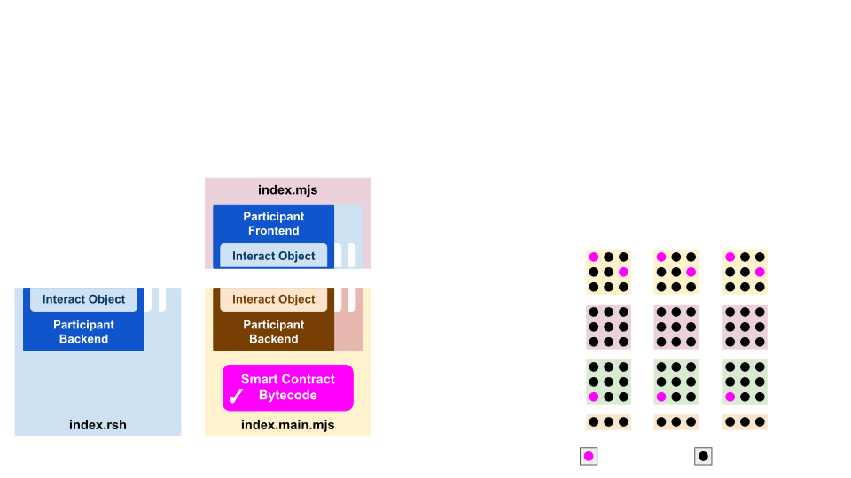

            
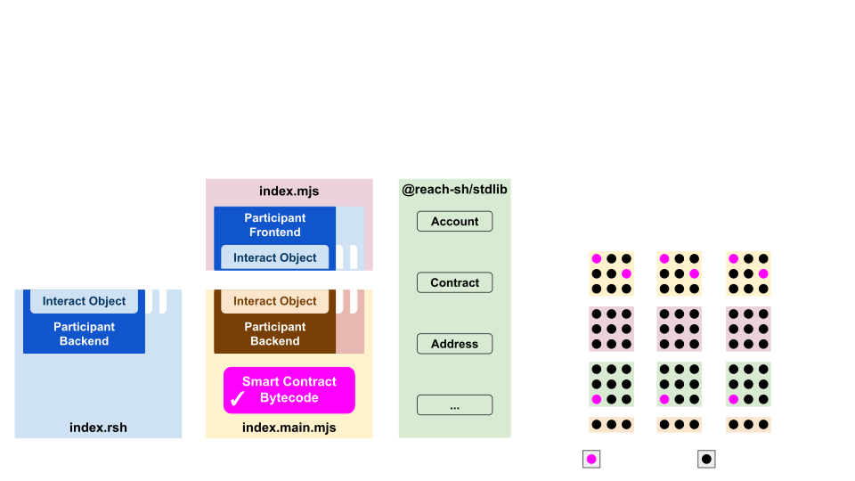

            
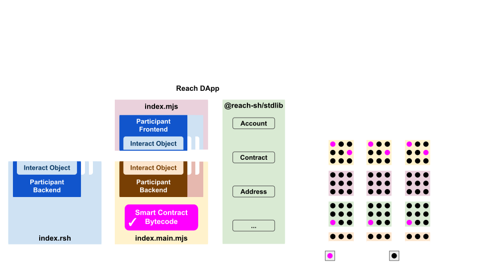

            
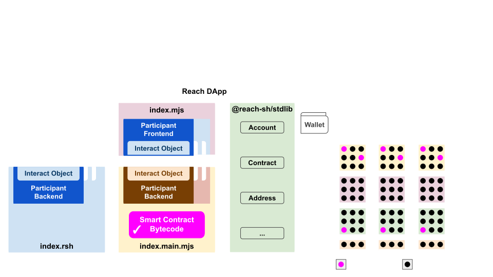

            
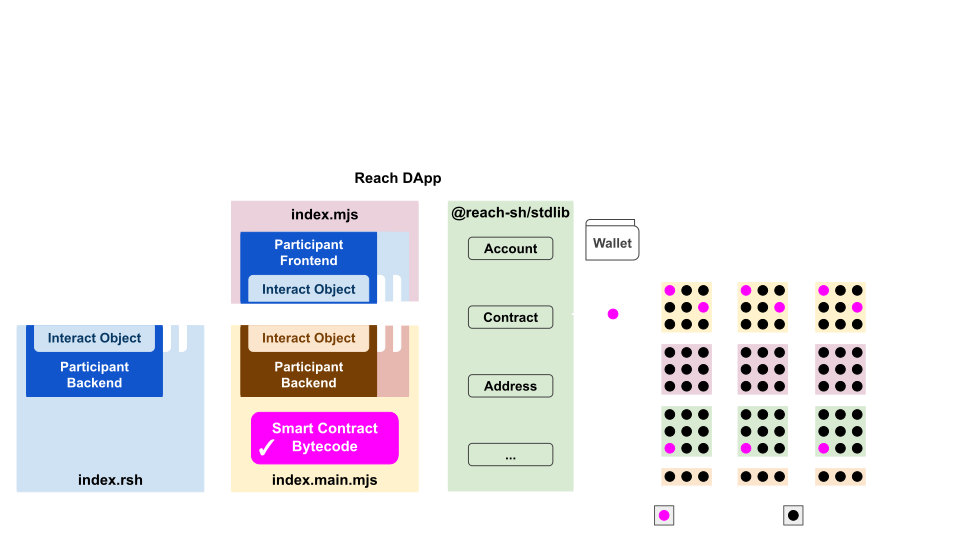

            
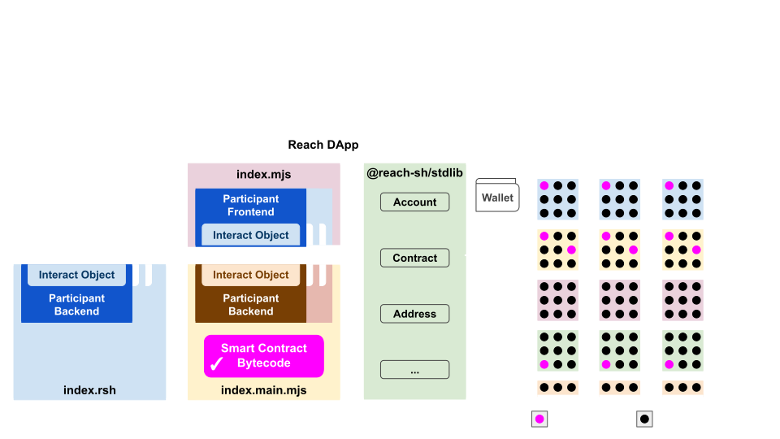

            
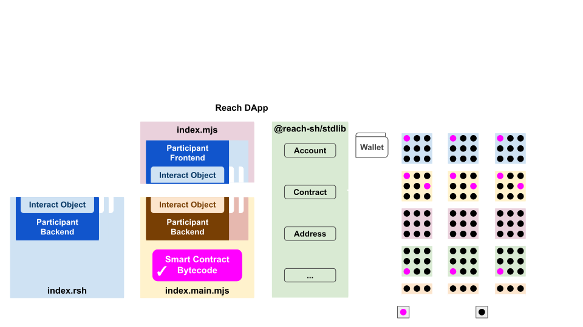

          

          <button class="carousel-control-prev" type="button" data-bs-target="#develop-and-deploy-carousel" data-bs-slide="prev" style="justify-content: left;">
            
            Previous
          </button>
          <button class="carousel-control-next" type="button" data-bs-target="#develop-and-deploy-carousel" data-bs-slide="next" style="justify-content: right;">
            
            Next
          </button>
        

      

    

  

  

    
<a class="nav-link-a follow" href="https://discord.com/invite/AZsgcXu"><i class="fab fa-discord fa-lg"></i></a>

    
<a class="nav-link-a follow" href="https://github.com/reach-sh/reach-lang"><i class="fab fa-github fa-lg"></i></a>

    
<a class="nav-link-a follow" href="https://twitter.com/reachlang"><i class="fab fa-twitter fa-lg"></i></a>

    
<a class="nav-link-a follow" href="https://www.youtube.com/c/Reachsh"><i class="fab fa-youtube fa-lg"></i></a>

    
<a class="nav-link-a follow" href="https://www.reddit.com/r/reach_sh"><i class="fab fa-reddit-square fa-lg"></i></a>

  

