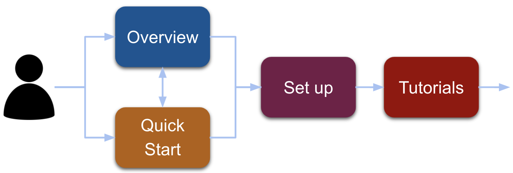

# Welcome Developers!

<section class="text-center">
  

    

      
Reach is a programming language for building blockchain applications.</b>

      
New to Reach DApp development?</b>

    

  

  

    
    <map name="image-map-700">
        <area target="" alt="Overview Video" title="Overview Video" href="/en/books/essentials/" coords="157,11,285,92" shape="rect">
        <area target="" alt="Quick Start" title="Quick Start" href="/en/books/essentials/quick-start/" coords="157,149,285,230" shape="rect">
        <area target="" alt="Development Environment" title="Development Environment" href="/en/books/essentials/development-environment/" coords="356,78,485,161" shape="rect">
        <area target="" alt="Tutorials" title="Tutorials" href="/en/books/essentials/tutorials/" coords="525,80,652,160" shape="rect">
    </map>
  

  

    
    <map name="image-map-600">
        <area target="" alt="Overview Video" title="Overview Video" href="/en/books/essentials/" coords="136,9,244,78" shape="rect">
        <area target="" alt="Quick Start" title="Quick Start" href="/en/books/essentials/quick-start/" coords="135,128,244,197" shape="rect">
        <area target="" alt="Development Environment" title="Development Environment" href="/en/books/essentials/development-environment/" coords="306,69,416,139" shape="rect">
        <area target="" alt="Tutorials" title="Tutorials" href="/en/books/essentials/tutorials/" coords="450,68,559,137" shape="rect">
    </map>
  

  

    
    <map name="image-map-400">
        <area target="" alt="Overview Video" title="Overview Video" href="/en/books/essentials/" coords="91,8,163,52" shape="rect">
        <area target="" alt="Quick Start" title="Quick Start" href="/en/books/essentials/quick-start/" coords="91,85,164,131" shape="rect">
        <area target="" alt="Development Environment" title="Development Environment" href="/en/books/essentials/development-environment/" coords="205,46,276,92" shape="rect">
        <area target="" alt="Tutorials" title="Tutorials" href="/en/books/essentials/tutorials/" coords="300,48,372,91" shape="rect">
    </map>
  

</section>

# Reach Developer News

<!--
## October 2021

<ul style="padding-left: 1.6rem;">
<li>sss</li>
<li>sss</li>
<li>sss</li>
<li>sss</li>
<li>sss</li>
<li>sss</li>
</ul>

  <iframe 
    src="https://www.youtube.com/embed/G0X-BZWYrRs?start=5&rel=0" 
    frameborder="0"
    loading="lazy"
    allowfullscreen>
  </iframe>

-->

## September 2021

<ul style="padding-left: 1.6rem;">
<li>Improved <a href="https://github.com/reach-sh/reach-lang/blob/master/reach">Reach Script</a>.</li>
<li>Reduced Docker image download sizes.</li>
<li>Created <a href="https://github.com/reach-sh/ARCs/blob/reach-wallet/ARCs/arc-0011.md">Algorand Wallet Reach Browser Spec</a>.</li>
<li>Added support for <a href="https://confluxnetwork.org">Conflux</a>.</li>
<li>Added support for running local nodes on <a href="https://www.trufflesuite.com/ganache">Ganache</a>.</li>
<li>Upgraded Reach version of Algorand DevNet to 2.92.9.1.</li>
<li>Integrating <a href="https://unity.com">Unity Game Engine</a> with Reach.</li>
<li>Submitted proposal to support <a href="https://cardano.org">Cardano</a>.</li>
<li>Building an Automated Market Maker (AMM) Decentralized Exchange (DEX).</li>
<li>Welcomed seven new employees.</li>
<li>Added items to <a href="https://swag.reach.sh/">ReachMart</a> swag store.</li>
<li>Completed the Conflux Bounty Hack.</li>
<li>Shout out to Chris Nevers and the Specialty Team.</li>
</ul>

  <iframe 
    src="https://www.youtube.com/embed/E3fseK_UScU?start=5&rel=0" 
    frameborder="0"
    loading="lazy"
    allowfullscreen>
  </iframe>

## August 2021

<ul style="padding-left: 1.6rem;">
<li>Added capability to mint tokens from within a contract on Algorand and Ethereum.</li>
<li>Added capability to cache and query network transactions locally.</li>
<li>Redefind timeouts in terms of real-world time instead of consensus network block counts.</li>
<li>Started utilizing <a href="https://developer.algorand.org/articles/introducing-algorand-virtual-machine-avm-09-release">Algorand Virtual Machine (AVM) 0.9</a>.</li>
<li>Added capability to verify that a Reach DApp is interacting with the intended contract.</li>
<li>Added support for TypeScript (in addition to JavaScript).</li>
<li>Added <a href="/en/books/essentials/reach-language/error-codes/">Error Code</a> documentation.</li>
<li>Working on a full <a href="https://confluxnetwork.org/">Conflux</a> integration.</li>
<li>Added better versioning to the Reach <a href="/en/pages/changelog/">Changelog</a>.</li>
<li>Welcomed four new employees.</li>
<li>Reached 2000 developer milestone.</li>
</ul>

  <iframe 
    src="https://www.youtube.com/embed/ml6v5n0eEFU?start=5&rel=0" 
    frameborder="0"
    loading="lazy"
    allowfullscreen>
  </iframe>

For older montly updates, see the [Reach Youtube](https://www.youtube.com/c/Reachsh/search?query=monthly%20update) video list.
